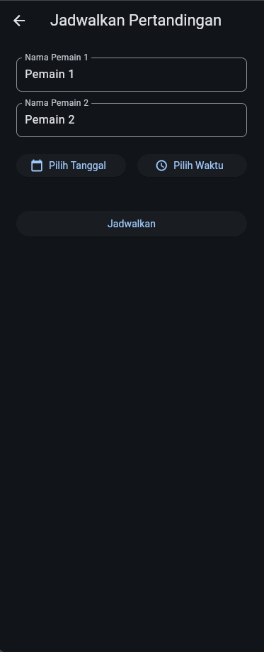

# RacketLogp

## Deskripsi Singkat
RacketLog adalah aplikasi mobile berbasis Flutter yang dirancang untuk para penggemar dan pemain badminton. Fungsi utamanya adalah untuk mencatat skor pertandingan secara *real-time* dan menjadwalkan pertandingan yang akan datang. Setiap pengguna memiliki akun pribadi untuk menyimpan riwayat dan jadwal pertandingan mereka dengan aman di cloud.

## Fitur Utama
-   **Autentikasi Pengguna:** Sistem registrasi dan login yang aman.
-   **Pencatatan Skor:** Antarmuka interaktif untuk mencatat skor poin per poin sesuai aturan standar badminton (termasuk *deuce* dan batas 30 poin).
-   **Penjadwalan Pertandingan:** Membuat, melihat, dan mengelola jadwal pertandingan yang akan datang.
-   **Riwayat Pertandingan:** Semua pertandingan yang telah selesai akan tersimpan secara otomatis dan dapat dilihat kembali.

## Teknologi yang Digunakan
-   ✅ **Firebase Auth:** Digunakan untuk menangani seluruh proses otentikasi pengguna, termasuk registrasi dan login menggunakan email dan password.
-   ✅ **Cloud Firestore:** Berfungsi sebagai database NoSQL utama. Data disimpan dalam dua koleksi utama:
    -   `matches`: Untuk menyimpan semua data riwayat pertandingan yang telah selesai.
    -   `scheduled_matches`: Untuk menyimpan semua jadwal pertandingan yang akan datang.
-   ✅ **Animasi Lottie:** Menggunakan paket `lottie` untuk menampilkan animasi dari file JSON (`assets/animations/success.json`) setelah pengguna berhasil melakukan registrasi atau login, memberikan *feedback* visual yang menarik.
-   ✅ **Shared Preferences:** Sesi login.
-   ✅ **JSON Server:** Untuk menyimpan quotes motivasi.

# Tampilan
 
 
 
 
 

## Struktur Folder
Struktur folder utama yang relevan dalam proyek ini adalah sebagai berikut:
```
racketlog/
├── lib/
│   ├── screens/                  # Berisi semua halaman utama aplikasi
│   │   ├── home_screen.dart      # Halaman utama dengan tab riwayat & jadwal
│   │   ├── login_screen.dart     # Halaman login
│   │   ├── match_screen.dart     # Halaman pencatatan skor
│   │   ├── register_screen.dart  # Halaman registrasi
│   │   ├── schedule_match_screen.dart # Halaman untuk membuat jadwal
│   │   └── success_screen.dart   # Halaman animasi setelah login/register
│   ├── widgets/                  # Berisi widget yang dapat digunakan kembali
│   │   └── auth_gate.dart        # Mengatur alur antara login dan home
│   ├── firebase_options.dart     # Konfigurasi koneksi ke Firebase
│   └── main.dart                 # Titik masuk utama aplikasi
│
├── assets/
│   └── animations/
│       └── success.json          # File animasi Lottie
├── db.json                       # Data Motivasi
│
│
└── pubspec.yaml                  # Daftar dependensi dan aset proyek

